---
title: "Multi-omics Data Integration"
author: "Amrit Singh, PhD<br><span style = 'font-size: 75%;'>Assistant Professor</span>"
date: 'June 7th, 2023 | 13:00-15:00 PST<br><br>TOG Intermediate Workshop <br> BCCHR Trainee Omics Group (TOG) <br> <br> [Comp Bio lab](https://cbl-hli.med.ubc.ca/)<br> [code](https://github.com/singha53/tog_workshop)'
output:
  xaringan::moon_reader:
    css: [default, middlebury-fonts, "theme.css"]
    lib_dir: libs
    nature:
      titleSlideClass: ["center", "middle", "my-title"]
      ratio: '16:9'
      highlightStyle: github
      highlightLines: true
      countIncrementalSlides: false
---


# Land acknowledgement

.pull-left[
**I would like to acknowledge that I work on the traditional, ancestral, and unceded territory of the Coast Salish Peoples, including the territories of the xwməθkwəy̓əm (Musqueam), Skwxwú7mesh (Squamish), Stó:lō and Səl̓ílwətaʔ/Selilwitulh (Tsleil- Waututh) Nations.**

*Traditional*: Traditionally used and/or occupied by Musqueam people

*Ancestral*: Recognizes land that is handed down from generation to generation

*Unceded*: Refers to land that was not turned over to the Crown (government) by a treaty or other agreement

]

.pull-right[
.center[]
]

---

# What are your expectations from today's workshop?

.center[]

---

class: middle

# Learning outcomes

By the end of this lecture you will be able to:

### 1. Describe what the *mixOmics* R-library can do.
### 2. Describe when to use which method and for what purpose (exploration, classification, integration).
### 3. Analyze data using mixOmics for various purposes (exploration, classification, integration)

---

# High-dimensional data

- n <<< p (number of observations is much smaller than the number variables)
- data is highly correlated


.pull-left-sm[
## univariate

```
##         p_1
## 1  -0.49500
## 2   2.13000
## 3  -0.40000
## 4   0.23100
## 5   0.13700
## 6   1.53000
## 7  -1.50000
## 8  -0.00716
## 9   1.85000
## 10  0.51800
```
]

.pull-right-lrg[
## multivariate

```
##        p_1     p_2    p_3     p_4    p_5    p_6     p_7     p_8     p_9   p_10
## 1   0.1550 -2.1100 -0.320 -1.0900 -1.040 -0.580 -1.1500  1.5100 -0.8270 -0.202
## 2   0.2540 -0.6970 -0.148  0.3460 -1.750 -1.080 -0.5590  1.1000 -0.6950  0.177
## 3   0.6370 -0.5300 -0.876  0.0727  1.530 -1.530  0.7630 -1.6300 -0.6950 -0.532
## 4  -0.8530  1.7800 -0.242 -1.1400  0.477  1.710 -0.5640 -1.0600  0.0594 -0.566
## 5   0.0749  0.1770 -1.630 -0.4810  0.659  0.561 -0.8400  1.1300  0.2970 -0.785
## 6  -1.8100 -0.0823  0.279 -0.9110  0.722  1.900 -0.3170  0.5820 -0.0826  0.286
## 7   0.4620 -0.7070 -0.104  1.4700  0.244 -0.687  0.0971 -0.6460  0.2820 -1.210
## 8  -0.2200  1.0000  2.310  1.3200 -0.246 -0.375  0.9110  0.2210 -0.1190  1.640
## 9  -0.6250 -0.1370 -2.540  0.0416 -0.182  0.603  0.7160  1.8000 -2.4200  0.444
## 10 -0.2250 -1.2900  0.260 -0.8460 -0.791 -0.320  0.7870 -0.0966 -0.3240  1.260
```

.center[]
]

---

# What can you do with high-dimensional data?

.pull-left[

### Unsupervised (clustering)
.center[]
[Chire 2017](https://commons.wikimedia.org/wiki/File:K-means_convergence.gif)
]

.pull-right[

### Supervised (regression/classification)
.center[]
[Tensorflow playground](https://playground.tensorflow.org/)
]

---

# mixOmics

- initiative started and maintained by Prof Kim-Anh Lê Cao
- R-library with 19 methods for high-dimensional data (exploratory analyses, classification, regression, data integration, meta-analysis)
.center[]

---

# What does mixOmics offer? methods...


.center[]
[mixOmics.org](http://mixomics.org/) | *variable selection

---

# What does mixOmics offer? when to use these methods...


.center[]
[Selecting your method](http://mixomics.org/methods/selecting-your-method/)


---

# What does mixOmics offer? graphics...


.center[]
[mixOmics.org](http://mixomics.org/)

---

# Getting started with mixOmics

1. Download [R](https://cran.r-project.org/mirrors.html)
2. Download [RStudio](https://posit.co/download/rstudio-desktop/)
3. install [mixOmics](https://www.bioconductor.org/packages/release/bioc/html/mixOmics.html)

## install mixOmics


```r
if (!require("BiocManager", quietly = TRUE))
    install.packages("BiocManager")

BiocManager::install("mixOmics")
```

## load vignette


```r
openVignette("mixOmics")
```

---

# Dataset used in this talk

## Breast Cancer multi omics data from TCGA

This data set is a small subset of the full data set from The Cancer Genome Atlas that can be analysed with the DIABLO framework. It contains the expression or abundance of three matching omics data sets: mRNA, miRNA and proteomics for 150 breast cancer samples (Basal, Her2, Luminal A) in the training set, and 70 samples in the test set. The test set is missing the proteomics data set.

.pull-left[

```r
library(mixOmics)
data(breast.TCGA)
lapply(breast.TCGA$data.train, dim)
```

```
## $mirna
## [1] 150 184
## 
## $mrna
## [1] 150 200
## 
## $protein
## [1] 150 142
## 
## $subtype
## NULL
```
]

.pull-right[
## breast cancer subtypes

```r
addmargins(table(breast.TCGA$data.train$subtype))
```

```
## 
## Basal  Her2  LumA   Sum 
##    45    30    75   150
```

]

---


# Analysis plan

| Analysis      | Methods | Functions     | 
| -----------       |    -----------   |          ----------- | 
| Exploratory data analysis    | PCA       |  pca() <br> plotIndiv()   | 
| | | | 
| Discriminant analysis   | sPLSDA        | splsda() <br> tune(), perf() <br> plotIndiv(), plotVar()      |
| | | | 
| Data integration analysis   | DIABLO        | block.splsda() <br> tune(), perf() <br> plotDiablo(), circosPlot()  |

---

# Exploratory data analysis using PCA


```r
J <- length(breast.TCGA$data.train)-1
pcs <- lapply(breast.TCGA$data.train[1:J], pca)

mapply(function(pca, dataset){
  plotIndiv(pca, 
            title=dataset, 
            group=breast.TCGA$data.train$subtype, 
            style="graphics",
            legend=TRUE)
}, pca=pcs, dataset=names(breast.TCGA$data.train)[1:J])
```

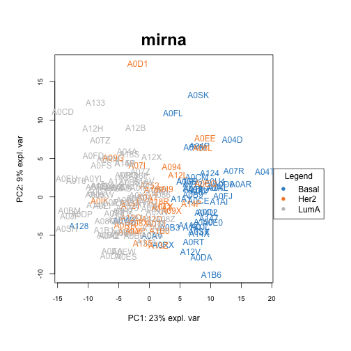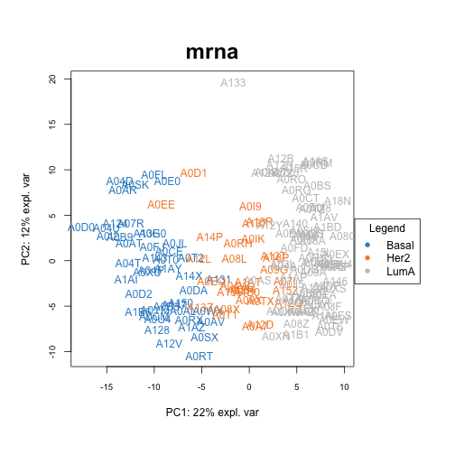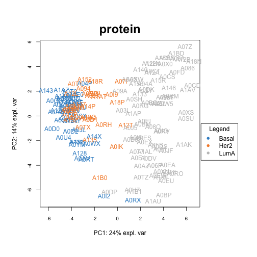

```
##            mirna         mrna          protein      
## df         data.frame,10 data.frame,10 data.frame,10
## df.ellipse NULL          NULL          NULL         
## graph      NULL          NULL          NULL
```

---

# Discriminant analysis using sPLSDA

- based on the eda it seems **mrna** is better at separating classes than **mirna**, lets test this.
- this may or may not be true since we peeked at the data (need to test model with another dataset)

.pull-left[
- mrna


```r
mrna_model <- splsda(X = breast.TCGA$data.train$mrna,
                      Y = breast.TCGA$data.train$subtype,
                      keepX = c(5, 5),
                      ncomp = 2)
mrna_perf <- perf(mrna_model, validation = "Mfold", folds = 5, nrepeat = 5)
mrna_perf$error.rate
```

```
## $overall
##        max.dist centroids.dist mahalanobis.dist
## comp1 0.2173333          0.168        0.1680000
## comp2 0.0920000          0.104        0.1306667
## 
## $BER
##        max.dist centroids.dist mahalanobis.dist
## comp1 0.3478519      0.1865185        0.1865185
## comp2 0.1202963      0.1179259        0.1447407
```
]

.pull-right[
- mirna


```r
mirna_model <- splsda(X = breast.TCGA$data.train$mirna,
                      Y = breast.TCGA$data.train$subtype,
                      keepX = c(5, 5),
                      ncomp = 2)
mirna_perf <- perf(mirna_model, validation = "Mfold", folds = 5, nrepeat = 5)
mirna_perf$error.rate
```

```
## $overall
##        max.dist centroids.dist mahalanobis.dist
## comp1 0.2573333          0.308            0.308
## comp2 0.2133333          0.232            0.208
## 
## $BER
##        max.dist centroids.dist mahalanobis.dist
## comp1 0.3822222      0.3262222        0.3262222
## comp2 0.2952593      0.2557037        0.2522963
```
]

---

## Find optimal models

.pull-left[

- mrna


```r
tune_mrna = tune(method = "splsda", X = breast.TCGA$data.train$mrna, 
                 Y=breast.TCGA$data.train$subtype, ncomp=3, nrepeat=5,
                 test.keepX = c(5, 10, 15, 30, 100, 200), folds=5, dist="max.dist", 
                 progressBar = FALSE)

plot(tune_mrna)
```

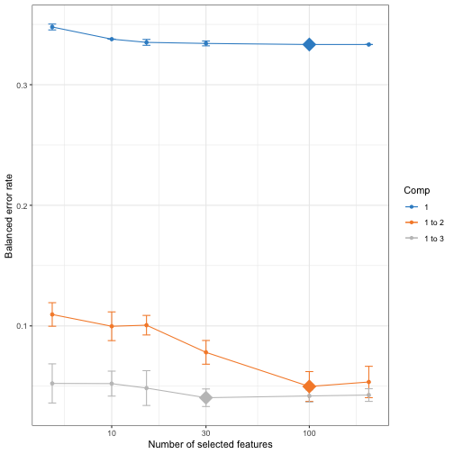
]

.pull-right[

- mirna


```r
tune_mirna = tune(method = "splsda", X = breast.TCGA$data.train$mirna, 
                 Y=breast.TCGA$data.train$subtype, ncomp=3, nrepeat=5,
                 test.keepX = c(5, 10, 15, 30, 100, 200), folds=5, dist="max.dist", 
                 progressBar = FALSE)

plot(tune_mirna)
```

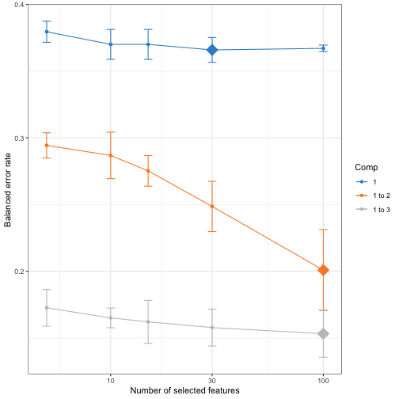
]

---

## Test sPLSDA models using data from other observations (patients)

.pull-left[

- mrna


```r
mrna_model <- splsda(X = breast.TCGA$data.train$mrna,
                      Y = breast.TCGA$data.train$subtype,
                      keepX = rep(5, 3),
                      ncomp = 3)
mrna_pred <- predict(mrna_model, newdata = breast.TCGA$data.test$mrna)

plotIndiv(mrna_model, comp = 1:2, rep.space = "X-variate", style="graphics", ind.names=FALSE, ellipse = TRUE, cex=0, title=paste0("mrna, BER=", calc_err(mrna_pred, breast.TCGA$data.test$subtype)))
points(mrna_pred$variates[, 1], mrna_pred$variates[, 2], pch = 19, cex = 1.2, col=mixOmics::color.mixo(as.numeric(breast.TCGA$data.test$subtype)))
```

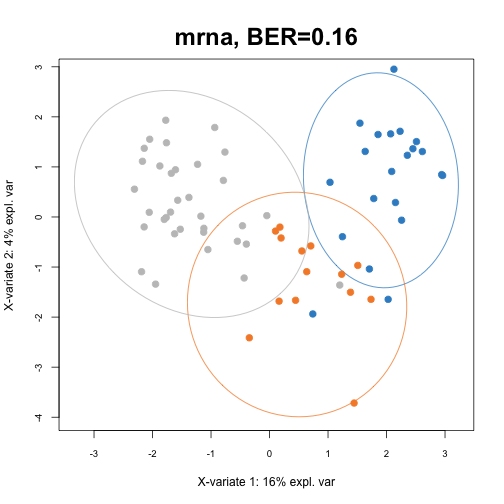
]

.pull-right[

- mirna


```r
mirna_model <- splsda(X = breast.TCGA$data.train$mirna,
                      Y = breast.TCGA$data.train$subtype,
                      keepX = rep(5, 3),
                      ncomp = 3)
mirna_pred <- predict(mirna_model, newdata = breast.TCGA$data.test$mirna)

plotIndiv(mirna_model, comp = 1:2, rep.space = "X-variate", style="graphics", ind.names=FALSE, ellipse = TRUE, cex=0, title=paste0("mIrna, BER=", calc_err(mirna_pred, breast.TCGA$data.test$subtype)))
points(mirna_pred$variates[, 1], mirna_pred$variates[, 2], pch = 19, cex = 1.2, col=mixOmics::color.mixo(as.numeric(breast.TCGA$data.test$subtype)))
```

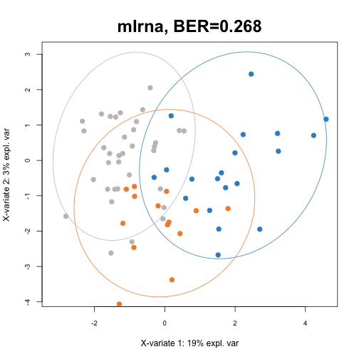
]

---

# Variables in mrna model

.pull-left[


```r
rbind(selectVar(mrna_model, comp=1)$value,
      selectVar(mrna_model, comp=2)$value,
      selectVar(mrna_model, comp=3)$value)
```

```
##            value.var
## ZNF552   -0.75801237
## KDM4B    -0.58296361
## PREX1    -0.20979766
## LRIG1    -0.17185790
## CCNA2     0.10963799
## CDK18     0.69045321
## TP53INP2 -0.68042479
## NDRG2     0.22678162
## STAT5A    0.07254351
## TRIM45    0.06003335
## JAM3      0.72727214
## E2F1     -0.53439117
## FRMD6     0.33920140
## ASF1B    -0.23142418
## HTRA1     0.12994836
```
]

.pull-right[

```r
cim(mrna_model, 
    row.sideColors = mixOmics::color.mixo(as.numeric(breast.TCGA$data.train$subtype)))
```

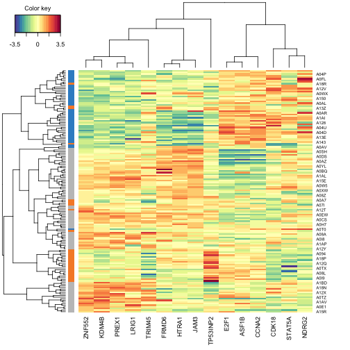
]

---

## Data integration using DIABLO

.pull-left[

### Design matters!


```r
data = list(mrna = breast.TCGA$data.train$mrna, mirna = breast.TCGA$data.train$mirna,
            protein = breast.TCGA$data.train$protein)
# set up a full design where every block is connected
# could also consider other weights, see our mixOmics manuscript
design = matrix(1, ncol = length(data), nrow = length(data),
                dimnames = list(names(data), names(data)))
diag(design) =  0
design
```

```
##         mrna mirna protein
## mrna       0     1       1
## mirna      1     0       1
## protein    1     1       0
```
]


.pull-right[

```r
# set number of component per data set
ncomp = 3
test.keepX = list(mrna = c(10, 30), mirna = c(15, 25), protein = c(4, 8))

## setup cluster - use SnowParam() on Widnows
BPPARAM <- BiocParallel::MulticoreParam(workers = parallel::detectCores()-1)
tune <- tune.block.splsda(
    X = data,
    Y = breast.TCGA$data.train$subtype,
    ncomp = ncomp,
    test.keepX = test.keepX,
    design = design,
    nrepeat = 2, 
    BPPARAM = BPPARAM
)
```

```
## Design matrix has changed to include Y; each block will be
##             linked to Y.
```

```
## 
## You have provided a sequence of keepX of length: 2 for block mrna and 2 for block mirna and 2 for block protein.
## This results in 8 models being fitted for each component and each nrepeat, this may take some time to run, be patient!
```

]

[Bioinformatics. 2019 Sep 1;35(17):3055-3062.](https://pubmed.ncbi.nlm.nih.gov/30657866/)


---

## Finding the optimal DIABLO model

.pull-left[

```r
plot(tune)
```

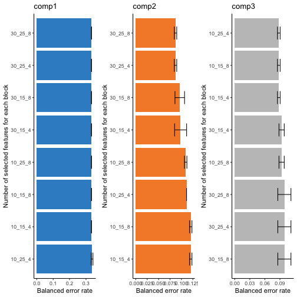

]

.pull-right[

```r
tune$choice.keepX
```

```
## $mrna
## [1] 10 30 10
## 
## $mirna
## [1] 15 25 15
## 
## $protein
## [1] 4 4 4
```

]

---

## DIABLO model

.pull-left[

```r
ncomp = length(tune$choice.keepX$mrna)

diablo <- block.splsda(X = breast.TCGA$data.train[1:3], 
                       Y = breast.TCGA$data.train$subtype, 
                       keepX=tune$choice.keepX,
                       ncomp = ncomp)
```
]

.pull-right[
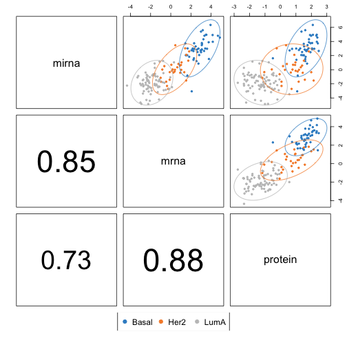
]

---

## DIABLO: Sample and variable plots

.pull-left[

```r
plotIndiv(diablo) 
```

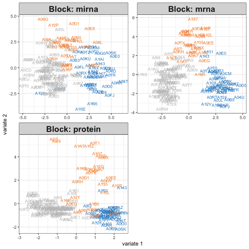
]

.pull-right[

```r
plotVar(diablo, var.names = c(TRUE, TRUE, TRUE),
        legend=TRUE, pch=c(16,16,1))
```

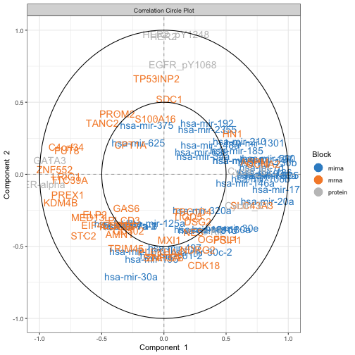
]

---

## DIABLO

.pull-left[

```r
cimDiablo(diablo, color.blocks = c('darkorchid', 'brown1', 'lightgreen'), 
          comp = 1, margin=c(8,20), legend.position = "right")
```

```
## 
## trimming values to [-3, 3] range for cim visualisation. See 'trim' arg in ?cimDiablo
```

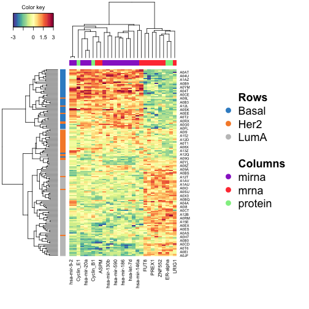
]

.pull-right[

```r
network(diablo, blocks = c(1,2,3),
        color.node = c('darkorchid', 'brown1', 'lightgreen'), 
        cutoff = 0.75)
```

]

---

.center[]
[Singh A et al., Handbook of Biomarkers and Precision Medicine CRC Press 2019:596](https://www.taylorfrancis.com/books/edit/10.1201/9780429202872/handbook-biomarkers-precision-medicine-claudio-carini-mark-fidock-alain-van-gool)

---

class: middle, center
background-image: url(img/website_bkg.png)
background-size: cover

# THANK YOU!

April 13th, 2023 | 11:45-12:35 EST<br><br> [Comp Bio lab](https://cbl-hli.med.ubc.ca/)<br> [code](https://github.com/singha53/UF_course_lecture)<br>
[Survey](https://ubc.ca1.qualtrics.com/jfe/form/SV_5bhbXGfN4R58nky)
