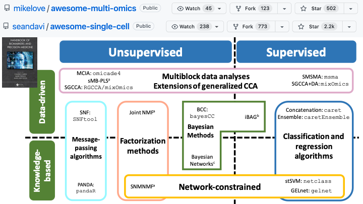

---
title: "Multi-omics Data Integration"
author: "Amrit Singh, PhD<br><span style = 'font-size: 75%;'>Assistant Professor</span>"
date: 'June 7th, 2023 | 13:00-15:00 PST<br><br>TOG Intermediate Workshop <br> BCCHR Trainee Omics Group (TOG) <br> <br>`r fontawesome::fa("link")` [Comp Bio lab](https://cbl-hli.med.ubc.ca/)<br>`r fontawesome::fa("github")` [code](https://github.com/singha53/tog_workshop)'
output:
  xaringan::moon_reader:
    css: [default, middlebury-fonts, "theme.css"]
    lib_dir: libs
    nature:
      titleSlideClass: ["center", "middle", "my-title"]
      ratio: '16:9'
      highlightStyle: github
      highlightLines: true
      countIncrementalSlides: false
---

```{r, echo=F, message=F, warning=F}

library(dplyr)
library(ggplot2)
library(mixOmics)
data(breast.TCGA)

## helper functions
## make random matrix of values
make_matrix = function(p){
  mat <- as.data.frame(matrix(signif(rnorm(p*10), 3), ncol = p))
  rownames(mat) <- 1:10
  colnames(mat) <- paste("p", 1:p, sep="_")
  mat
}

## calcualte balanced error for test data for splsda
calc_err = function(pred, truth, dist="max.dist"){
  conf_matrix <- table(pred$class[["max.dist"]][, "comp2"],
                       truth)
  err <- 1-diag(conf_matrix)/colSums(conf_matrix)
  signif(mean(err), 3)
}
```

# Land acknowledgement

.pull-left[
**I would like to acknowledge that I work on the traditional, ancestral, and unceded territory of the Coast Salish Peoples, including the territories of the xwməθkwəy̓əm (Musqueam), Skwxwú7mesh (Squamish), Stó:lō and Səl̓ílwətaʔ/Selilwitulh (Tsleil- Waututh) Nations.**

*Traditional*: Traditionally used and/or occupied by Musqueam people

*Ancestral*: Recognizes land that is handed down from generation to generation

*Unceded*: Refers to land that was not turned over to the Crown (government) by a treaty or other agreement

]

.pull-right[
.center[]
]

---

# What are your expectations from today's workshop?

.center[]

---

.center[]

---

class: middle

# Learning outcomes

By the end of this lecture you will be able to:

### 1. Describe what the *mixOmics* R-library can do.
### 2. Describe when to use which method and for what purpose (exploration, classification, integration).
### 3. Analyze data using mixOmics for various purposes (exploration, classification, integration)

---

# High-dimensional data

- n <<< p (number of observations is much smaller than the number variables)
- data is highly correlated


.pull-left-sm[
## univariate
```{r, echo=FALSE, size=0.7}
make_matrix(1)
```
]

.pull-right-lrg[
## multivariate
```{r, echo=FALSE, size=0.7}
make_matrix(10)
```

.center[]
]

---

# What can you do with high-dimensional data?

.pull-left[

### Unsupervised (clustering)
.center[]
[Chire 2017](https://commons.wikimedia.org/wiki/File:K-means_convergence.gif)
]

.pull-right[

### Supervised (regression/classification)
.center[]
[Tensorflow playground](https://playground.tensorflow.org/)
]

---

# mixOmics.org

- initiative started and maintained by Prof Kim-Anh Lê Cao
- R-library with 19 methods for high-dimensional data (exploratory analyses, classification, regression, data integration, meta-analysis)
.center[]

---

# What does mixOmics offer? methods...


.center[]
[mixOmics.org](http://mixomics.org/) | *variable selection

---

# What does mixOmics offer? when to use these methods...


.center[]
[Selecting your method](http://mixomics.org/methods/selecting-your-method/)


---

# What does mixOmics offer? graphics...


.center[]
[mixOmics.org](http://mixomics.org/)

---

# Getting started with mixOmics

1. Download [R](https://cran.r-project.org/mirrors.html)
2. Download [RStudio](https://posit.co/download/rstudio-desktop/)
3. install [mixOmics](https://www.bioconductor.org/packages/release/bioc/html/mixOmics.html)

## install mixOmics

```{r, eval=FALSE}
if (!require("BiocManager", quietly = TRUE))
    install.packages("BiocManager")

BiocManager::install("mixOmics")
```

## load vignette

```{r, eval=FALSE}
browseVignettes("mixOmics")
```

---

# Dataset used in this talk

## Breast Cancer multi omics data from TCGA

This data set is a small subset of the full data set from The Cancer Genome Atlas that can be analysed with the DIABLO framework. It contains the expression or abundance of three matching omics data sets: mRNA, miRNA and proteomics for 150 breast cancer samples (Basal, Her2, Luminal A) in the training set, and 70 samples in the test set. The test set is missing the proteomics data set.

.pull-left[
```{r}
library(mixOmics)
data(breast.TCGA)
lapply(breast.TCGA$data.train, dim)
```
]

.pull-right[
## breast cancer subtypes
```{r}
addmargins(table(breast.TCGA$data.train$subtype))
```

]

---


# Types of analyses covered:

| Analysis      | Methods | Functions     | Input | Output |
| -----------       |    -----------   |          ----------- | :-----------: | :-----------: | 
| Exploratory data analysis    | PCA       |  pca() <br> plotIndiv()   | *X* |  |
| | | | | |
| Discriminant analysis   | sPLSDA        | splsda() <br> tune(), perf() <br> plotIndiv(), plotVar()      | *X* | *Y* |
| | | | | |
| Data integration analysis   | DIABLO        | block.splsda() <br> tune(), perf() <br> plotDiablo(), circosPlot()  | *X<sub>1</sub>, ..., X<sub>J</sub>* | *Y*

---

# Exploratory data analysis using PCA

```{r, message=FALSE, out.width = '300px'}
J <- length(breast.TCGA$data.train)-1
pcs <- lapply(breast.TCGA$data.train[1:J], mixOmics::pca)

mapply(function(pca, dataset){
  mixOmics::plotIndiv(pca, 
            title=dataset, 
            group=breast.TCGA$data.train$subtype, 
            style="graphics",
            legend=TRUE,
            ellipse = TRUE,
            ellipse.level = 0.90)
}, pca=pcs, dataset=names(breast.TCGA$data.train)[1:J])

```

???
PCA notes: 
- visualize the global structure of a p-dimensional data matrix
- variation explained refers to how well the PCs captures (summarizes) the variability (information) in the data
- 

---

# Discriminant analysis using sPLSDA

- based on the eda it seems **mrna** is better at separating classes than **mirna**, lets test this.
- this may or may not be true since we peeked at the data (need to test model with another dataset)

.pull-left[
- mrna

```{r}
mrna_model <- mixOmics::splsda(X = breast.TCGA$data.train$mrna,
                      Y = breast.TCGA$data.train$subtype,
                      keepX = c(5, 5),
                      ncomp = 2)
mrna_perf <- mixOmics::perf(mrna_model, validation = "Mfold", folds = 5, nrepeat = 5)
mrna_perf$error.rate
```
]

.pull-right[
- mirna

```{r}
mirna_model <- mixOmics::splsda(X = breast.TCGA$data.train$mirna,
                      Y = breast.TCGA$data.train$subtype,
                      keepX = c(5, 5),
                      ncomp = 2)
mirna_perf <- mixOmics::perf(mirna_model, validation = "Mfold", folds = 5, nrepeat = 5)
mirna_perf$error.rate
```
]

???
sPLSDA notes:
- PLSDA: used to predict a single outcome variables *Y* from a *nxp* data matrix *X*
- sPLSDA: selects top *k* variables from *X*: (keepX=k)
- similar to PCA, you specify the number of components to retain in the model (ncomp)

test error:
- apply M-fold cross validation repeated *nrepeat* times; (folds=M)

---

.center[]

---

## How to select *ncomp* and *keepX*? use a grid of values

.pull-left[

- mrna

```{r, message=FALSE, out.width = '300px'}
tune_mrna = mixOmics::tune(method = "splsda", X = breast.TCGA$data.train$mrna, 
                 Y=breast.TCGA$data.train$subtype, ncomp=3, nrepeat=5,
                 test.keepX = c(5, 10, 15, 30, 100, 200), folds=5, dist="max.dist", 
                 progressBar = FALSE)
plot(tune_mrna)
```
]

.pull-right[

- mirna

```{r, message=FALSE, out.width = '300px'}
tune_mirna = mixOmics::tune(method = "splsda", X = breast.TCGA$data.train$mirna, 
                 Y=breast.TCGA$data.train$subtype, ncomp=3, nrepeat=5,
                 test.keepX = c(5, 10, 15, 30, 100, 200), folds=5, dist="max.dist", 
                 progressBar = FALSE)
plot(tune_mirna)
```
]

---

## Test sPLSDA models using data from other observations (patients)

.pull-left[

- mrna

```{r, message=FALSE, out.width = '250px'}
mrna_model <- splsda(X = breast.TCGA$data.train$mrna,
                      Y = breast.TCGA$data.train$subtype,
                      keepX = rep(5, 3),
                      ncomp = 3)
mrna_pred <- predict(mrna_model, newdata = breast.TCGA$data.test$mrna)

plotIndiv(mrna_model, comp = 1:2, rep.space = "X-variate", style="graphics", ind.names=FALSE, ellipse = TRUE, cex=0, title=paste0("mrna, BER=", calc_err(mrna_pred, breast.TCGA$data.test$subtype)))
points(mrna_pred$variates[, 1], mrna_pred$variates[, 2], pch = 19, cex = 1.2, col=mixOmics::color.mixo(as.numeric(breast.TCGA$data.test$subtype)))
```
]

.pull-right[

- mirna

```{r, message=FALSE, out.width = '250px'}
mirna_model <- splsda(X = breast.TCGA$data.train$mirna,
                      Y = breast.TCGA$data.train$subtype,
                      keepX = rep(5, 3),
                      ncomp = 3)
mirna_pred <- predict(mirna_model, newdata = breast.TCGA$data.test$mirna)

plotIndiv(mirna_model, comp = 1:2, rep.space = "X-variate", style="graphics", ind.names=FALSE, ellipse = TRUE, cex=0, title=paste0("mirna, BER=", calc_err(mirna_pred, breast.TCGA$data.test$subtype)))
points(mirna_pred$variates[, 1], mirna_pred$variates[, 2], pch = 19, cex = 1.2, col=mixOmics::color.mixo(as.numeric(breast.TCGA$data.test$subtype)))
```
]

---

# Model interpretation

- determine variables with most importance in mrna model

.pull-left[

```{r}
rbind(selectVar(mrna_model, comp=1)$value,
      selectVar(mrna_model, comp=2)$value,
      selectVar(mrna_model, comp=3)$value)
```
]

.pull-right[
```{r, out.width = '400px'}
cim(mrna_model, 
    row.sideColors = mixOmics::color.mixo(as.numeric(breast.TCGA$data.train$subtype)))
```
]

---

## DIABLO: an integrative classification method for multi-omics data

.pull-left[

### Design matters!

```{r, font.size='tiny'}
data = list(mrna = breast.TCGA$data.train$mrna, mirna = breast.TCGA$data.train$mirna,
            protein = breast.TCGA$data.train$protein)
# set up a full design where every block is connected
# could also consider other weights, see our mixOmics manuscript
design = matrix(1, ncol = length(data), nrow = length(data),
                dimnames = list(names(data), names(data)))
diag(design) =  0
design
```
]


.pull-right[
```{r}
# set number of component per data set
ncomp = 3
test.keepX = list(mrna = c(10, 30), mirna = c(15, 25), protein = c(4, 8))

## setup cluster - use SnowParam() on Widnows
BPPARAM <- BiocParallel::MulticoreParam(workers = parallel::detectCores()-1)
tune <- tune.block.splsda(
    X = data,
    Y = breast.TCGA$data.train$subtype,
    ncomp = ncomp,
    test.keepX = test.keepX,
    design = design,
    nrepeat = 2, 
    BPPARAM = BPPARAM
)
```

]

[Bioinformatics. 2019 Sep 1;35(17):3055-3062.](https://pubmed.ncbi.nlm.nih.gov/30657866/)


---

## Finding the optimal DIABLO model

.pull-left[
```{r, out.width = '400px'}
plot(tune)
```

]

.pull-right[
```{r}
tune$choice.keepX
```

]

---

## DIABLO model

.pull-left[
```{r}
ncomp = length(tune$choice.keepX$mrna)

diablo <- block.splsda(X = breast.TCGA$data.train[1:3], 
                       Y = breast.TCGA$data.train$subtype, 
                       keepX=tune$choice.keepX,
                       ncomp = ncomp)
```
]

.pull-right[
```{r, echo=F}
plotDiablo(diablo, ncomp = 1)
```
]

---

## DIABLO: Sample and variable plots

.pull-left[
```{r, out.width="80%"}
plotIndiv(diablo, ellipse = TRUE) 
```
]

.pull-right[
```{r, out.width="80%"}
plotVar(diablo, var.names = c(TRUE, TRUE, TRUE),
        legend=TRUE, pch=c(16,16,1))
```
]

---

## DIABLO

.pull-left[
```{r, message=F, warning=F, out.width="80%"}
cimDiablo(diablo, color.blocks = c('darkorchid', 'brown1', 'lightgreen'), 
          comp = 1, margin=c(8,20), legend.position = "right")
```
]

.pull-right[
```{r, message=F, warning=F, out.width="80%"}
network(diablo, blocks = c(1,2,3),
        color.node = c('darkorchid', 'brown1', 'lightgreen'), 
        cutoff = 0.75)
```

]

---

.center[]
[Singh A et al., Handbook of Biomarkers and Precision Medicine CRC Press 2019:596](https://www.taylorfrancis.com/books/edit/10.1201/9780429202872/handbook-biomarkers-precision-medicine-claudio-carini-mark-fidock-alain-van-gool)

---

class: middle, center
background-image: url(img/website_bkg.png)
background-size: cover

# THANK YOU!

June 7th, 2023 | 13:00-15:00 PST<br><br>TOG Intermediate Workshop <br> BCCHR Trainee Omics Group (TOG) <br> <br>`r fontawesome::fa("link")` [Comp Bio lab](https://cbl-hli.med.ubc.ca/)<br>`r fontawesome::fa("github")` [code](https://github.com/singha53/tog_workshop)